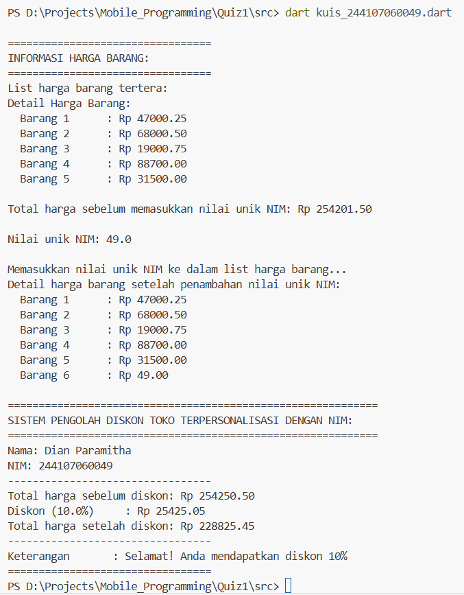

# Praktikum Kuis Pemrograman Mobile - Minggu 5

## Sistem Pengolah Diskon Toko yang dipersonalisasi dengan NIM

---

## 👤 Identitas

- **Nama:** Dian Paramitha
- **NIM:** 244107060049
- **Prodi:** Sistem Informasi Bisnis
- **Mata Kuliah:** Pemrograman Mobile
- **Dosen:** Ade Ismail, S.Kom., M.Ti

---

## Deskripsi

Repository ini berisi program Dart yang mendemonstrasikan penggunaan 3 digit terakhir NIM (049) sebagai nilai unik yang ditambahkan ke dalam daftar harga barang. Jadi ada pengaruh NIM terhadap Total Belanja.

**Detail Perhitungan:**

1. NIM: 244107060049
2. 3 digit terakhir NIM: **049**
3. Nilai unik NIM: **049 / 49.00 dalam format double**

Nilai ini ditambahkan sebagai elemen ke-6 dalam list hargaBarang, sehingga mempengaruhi total belanja keseluruhan.

---

### Komponen Program yang Dipenuhi

**1. Personalisasi NIM**

- Variabel 'nama' dan 'nim' dideklarasikan sesuai dengan identitas saya sebagai mahasiswa
- 3 digit terakhir NIM (049) disimpan dalam variabel 'nilaiUnikNIM'
- nilai unik ditambahkan ke dalam list harga barang pada elemen ke-6

**2. Deklarasi Koleksi**

- Menggunakan 'List<doubles>' dengan 5 harga awal barang
- Menambahkan 'nilaiUnikNIM' menggunakan metode '.add()'

**3. Implementasi Fungsi**

- Fungsi 'hitungTotal()' menerima parameter 'List<double>'
- Mengembalikan nilai 'double' sebagai total
- Menggunakan perulangan 'for-in' untuk menjumlahkan

**4. Logika Percabangan**

- Total > 200.000: diskon 10%
- Total 100.000-200.000: diskon 5%
- Total < 100.000: tidak ada diskon (0%)

**5. Null Safety & Sintaks**

- Variabel 'String? pesanDiskon' menggunakan nullable type
- Operator '!' digunakan saat mencetak karena sudah pasti terisi

**6. Manajemen Proyek**

- Struktur folder buat Kode: 'Quiz01/src/kuis_244107060049'
- Screenshot hasil eksekusi di folder 'docs/'

---

## Struktur Folder GitHub

```
Week#04/
├── src/
│   └── kuis_244107060049.dart
├── docs/
│   └── screenshot_output.png
└── README.md
```

---

## Bukti Output

* Hasil eksekusi program kuis_244107060049: *


---

## Bagaimana NIM mempengaruhi total belanja

* Bagaimana nilai unik NIM dapat mempengaruhi harga barang *, Karena total harga barang awal sebelum dimasukkan nilai unik NIM saya yaitu (049 atau 49.00 dalam double) adalah Rp 254.201,50 tetapi karena ditambah nilai unik saya jadinya 254.250,50 jadi total harga barang bertambah sekitar 49.00 rupiah. Jika dibayangkan saya hanya nambah 1 item bernilai 49.00 rupiah ke dalam list belanja saya yang sebelumnya 5 item.